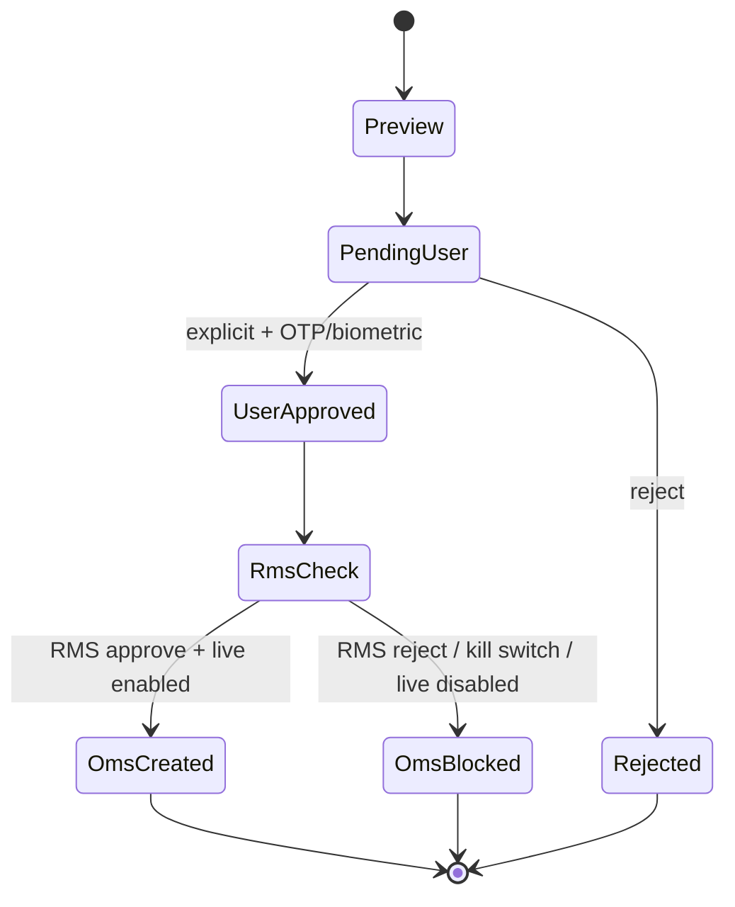

# Approval workflow

```mermaid
stateDiagram-v2
  [*] --> Preview
  Preview --> PendingUser
  PendingUser --> UserApproved: explicit + OTP/biometric
  PendingUser --> Rejected: reject
  UserApproved --> RmsCheck
  RmsCheck --> OmsBlocked: RMS reject / kill switch / live disabled
  RmsCheck --> OmsCreated: RMS approve + live enabled
  OmsCreated --> [*]
  OmsBlocked --> [*]
  Rejected --> [*]
```

DhanLaxmi **never** calls the broker. Gateway RMS/OMS/execution router own live placement.
Non-admin users cannot self-set `rms_approved` through the gateway proxy.
